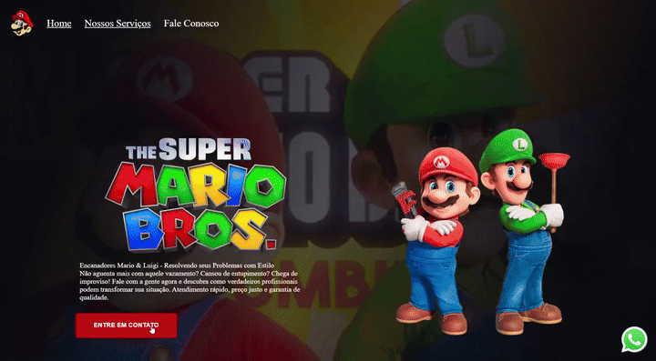

# 🍄 Mario Bros — Estudo de Animações CSS e DOM

> Estudo de animações CSS e manipulação de DOM interativo com temática clássica do Super Mario Bros, desenvolvido de forma leve, fluida e responsiva.

[](https://mario-bros-seven.vercel.app)


🟢 **LIVE DEMO:** [Acesse o Mario Bros Ao Vivo Aqui](https://mario-bros-seven.vercel.app)

<div align="center">
  <div style="max-width: 800px; background-color: #161b22; border: 1px solid #30363d; border-bottom: none; border-top-left-radius: 8px; border-top-right-radius: 8px; padding: 10px; font-family: monospace; font-size: 13px; color: #8b949e; text-align: left;">
    🔴 &nbsp; 🟡 &nbsp; 🟢 &nbsp;&nbsp;&nbsp; <b>~/mario-bros</b>
  </div>
  <div style="max-width: 800px; border: 1px solid #30363d; border-bottom-left-radius: 8px; border-bottom-right-radius: 8px; overflow: hidden; line-height: 0;">
    
  </div>
</div>

---

### 🗣️ Sobre o Projeto

O **Mario Bros** é um projeto de estudo dedicado à exploração dos limites de animações por CSS Keyframes, transições e manipulação direta de eventos no DOM. Inspirado no clássico jogo do encanador mais famoso do mundo, a aplicação traz interatividade sonora e visual de forma extremamente leve, rodando diretamente no navegador sem a necessidade de canvas complexos ou engines pesadas.

---

### ✨ Features

- 🎮 **Animações em CSS puro** — Movimentos e sprites coreografados via `@keyframes` e `steps()`, aliviando o processamento do JavaScript.
- 🔊 **Interatividade Sonora** — Efeitos sonoros sincronizados para dar vida e aumentar o engajamento visual.
- 📱 **Design Responsivo** — Ajustado perfeitamente para diferentes tamanhos de tela (mobile, tablet e desktop).
- ⚡ **Performance Leve** — Construído inteiramente com tecnologias web nativas, proporcionando carregamento instantâneo.
- 🛠️ **Zero Dependências** — Código vanilla limpo, livre de bibliotecas ou frameworks externos.

---

### 🛠️ Tecnologias

| Tech | Uso |
| --- | --- |
| **HTML5** | Estruturação semântica da aplicação e elementos multimídia. |
| **CSS3** | Coreografia de animações, transições e design totalmente responsivo. |
| **JavaScript (ES6+)** | Lógica de controle de eventos e manipulação dinâmica de elementos no DOM. |

---

### 📁 Estrutura do Projeto

```text
mario-bros/
├── index.html       # Estrutura principal da página
├── style.css        # Animações avançadas e estilos
├── script.js        # Lógica de interações e efeitos sonoros
├── imagem.img/      # Pasta contendo imagens e assets visuais
└── public/videos/   # Mídia de demonstração (GIF)
```

---

### 🚀 Como Executar Localmente

Como este projeto é construído apenas com HTML, CSS e JavaScript puros (sem dependências ou compilação), você pode executá-lo de três maneiras simples:

#### Opção 1: Direto no Navegador
Basta abrir o arquivo `index.html` diretamente em seu navegador dando um duplo clique sobre ele.

#### Opção 2: Com VS Code Live Server
Se estiver utilizando o VS Code, instale a extensão **Live Server**, abra a pasta do projeto e clique em **"Go Live"** no canto inferior direito para rodar o projeto com recarregamento em tempo real.

#### Opção 3: Servidor Local Rápido
Caso tenha o Node.js ou Python instalados, execute na raiz do projeto:

**Com Node.js (`npx serve`):**
```bash
npx serve .
```

**Com Python:**
```bash
python -m http.server 8000
```
Em seguida, acesse `http://localhost:8000` em seu navegador.

---

### 📄 Licença

Projeto para portfólio. Desenvolvido por **Jeanderson Silva**.
